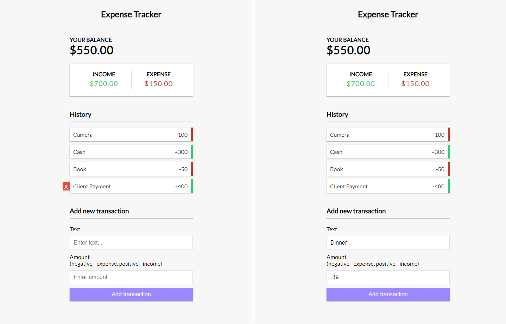
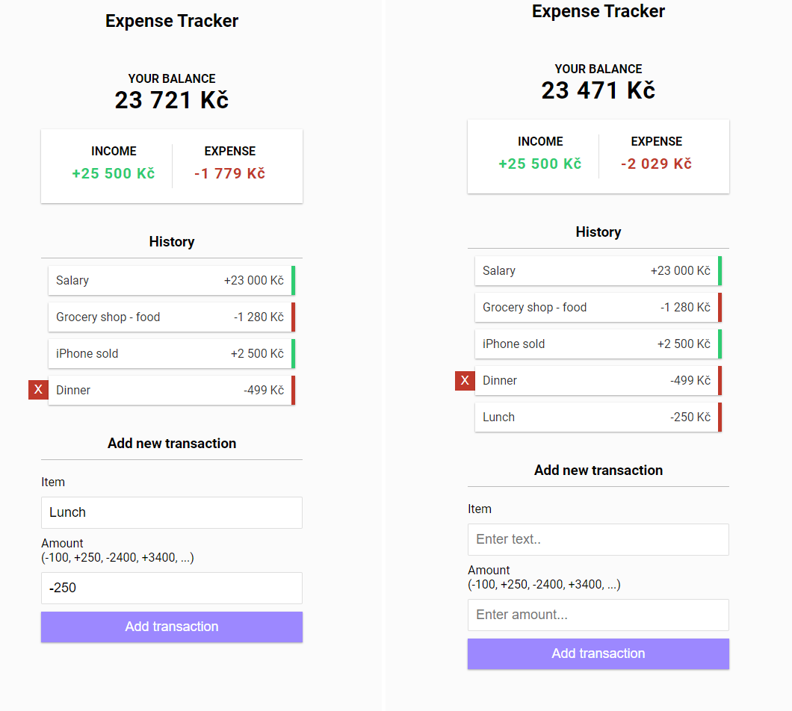

# Udemy--vanillawebprojects-09

**The ninth** of a series of **20 small projects** in **Vanilla JavaScript** from the [**Udemy course**](https://www.udemy.com/course/web-projects-with-vanilla-javascript/) by author [Brad Traversy](https://www.traversymedia.com/) with this [Brad's original GitHub repository](https://github.com/bradtraversy/vanillawebprojects).

# 09: Expense Tracker

Keep track of income and expenses. Add and remove items and save to local storage

## Project Specifications

- Create **UI** for project
- **Display transaction items** in DOM
- **Show balance, expense and income** totals
- Add **new transation** and reflect in total
- **Delete items** from DOM
- Persist to **local storage**

## Original preview

    

## My solution preview

    

## My solution features

- Custom **UI/UX design**
- Converted to **Czech currency and formatting**

# Author

Website - [Petr Bednarski](https://github.com/pettik)  
Frontend Mentor - [@pettik](https://www.frontendmentor.io/profile/pettik)
